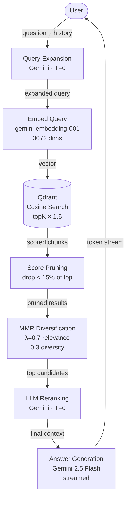
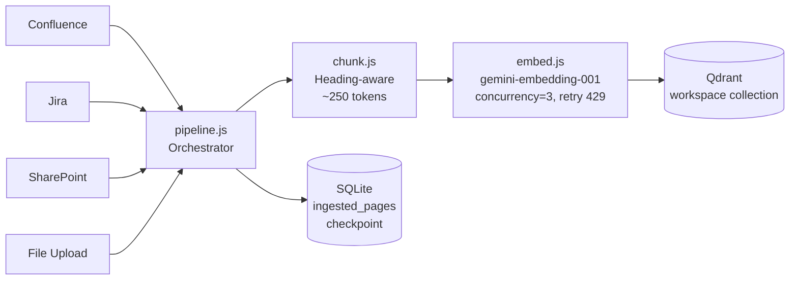

# Architecture

## Overview

The app is a RAG (Retrieval-Augmented Generation) pipeline. When a user asks a question:

1. The query is expanded (acronyms, pronouns resolved)
2. The expanded query is embedded into a vector
3. Qdrant returns the most semantically similar document chunks
4. Noisy results are pruned and diversified
5. Gemini reranks and then streams a grounded answer

Each team has its own workspace: a dedicated Qdrant collection, API key, and Confluence page configuration.

---

## Diagrams

### Query Flow



### Ingestion Flow



---

## Key Decisions

### LLM and Embeddings: Google Vertex AI (Gemini)

**Why:** The organisation is already on Google Cloud. Using Vertex AI keeps all data within the GCP boundary, uses Application Default Credentials (no API key management), and aligns with internal cloud strategy.

**Model choices:**
- `gemini-2.5-flash` for generation — fast, cost-efficient, strong instruction following
- `gemini-embedding-001` for embeddings — 3072-dimensional vectors, strong semantic retrieval

**SDK:** `@google/genai` (the new unified Google AI SDK). The older `@google-cloud/vertexai` SDK is deprecated and had silent hangs on `embedContent` — do not use it.

---

### Vector Store: Qdrant OSS on GCE

**Why not Qdrant Cloud:** Third-party SaaS — internal data cannot leave the organisation's GCP boundary.

**Why not Google Cloud Vector Search:** Managed GCP service (data stays in GCP), but costs ~$68/month minimum with no scale-to-zero. Too expensive for an MVP.

**Decision:** Self-host Qdrant OSS in Docker on a GCE e2-small VM (~$12–17/month) inside the organisation's GCP project. Data never leaves GCP. The Qdrant API is identical to Qdrant Cloud, so migration later is a one-line config change.

**Collection naming:** One collection per team, named after the workspace (e.g. `codp`, `pot`). Collections are created automatically on first ingest.

---

### Chunking: Structure-Aware, ~250 Tokens

**Why not fixed character splits:** A 800-character split cuts mid-sentence, mid-table, and mid-code-block. The retriever gets incoherent fragments that hurt answer quality.

**Approach:**

- Pass 1: Split at heading boundaries (H1/H2/H3). Each heading starts a new section. Code blocks are never split mid-fence.
- Pass 2: If a section exceeds 250 tokens, split further with 30-token overlap using character estimation (~4 chars/token).
- Each chunk gets a **preamble**: `{Page Title} > {Heading Path}` prepended. This means the embedding captures the document context, not just the local text.

**Token estimation:** Character-based (`length / 4`) rather than a real tokenizer. A real tokenizer caused O(n²) hangs on large pages. The estimation is accurate enough for splitting — exact token counts only matter at the LLM prompt boundary, which Express handles separately.

---

### Retrieval Pipeline

```
query
  └─ expandQuery (Gemini, T=0)        — resolve pronouns, expand acronyms
       └─ getEmbedding                 — gemini-embedding-001, 3072 dims
            └─ semanticSearch (Qdrant) — cosine similarity, topK * 1.5 candidates
                 └─ pruneByScore       — drop results < 15% of top score
                      └─ applyMMR      — λ=0.7 relevance / 0.3 diversity
                           └─ rerankResults (Gemini, T=0) — pick final top-K
```

**Query expansion:** Especially valuable for internal acronyms specific to your team. Gemini also uses the last 6 messages to resolve follow-up questions ("what about that pipeline?" → the full pipeline name).

**Score pruning:** Drops the long tail of low-relevance results. Threshold at 15% of the top score — research-backed, simple, no hyperparameter tuning needed.

**MMR (Maximal Marginal Relevance):** Prevents returning 5 near-identical chunks. Greedy selection: at each step, pick the candidate that maximises `λ * relevance - (1-λ) * similarity_to_already_selected`. λ=0.7 weights relevance more than diversity.

**LLM reranking:** A second Gemini call asks the model to pick the best results given the question. Catches cases where semantic similarity alone misses the best answer. Temperature=0 for determinism.

---

### Connector Architecture

Each source is a class extending `BaseConnector`. The pipeline iterates documents via `streamDocuments()` — an async generator so each page is fetched, embedded, and upserted before the next is fetched. This keeps memory low and makes ingestion resumable.

```
BaseConnector
  ├── ConfluenceConnector   — Confluence REST API v2, streaming page-tree traversal, retry on 429/5xx
  ├── JiraConnector         — Jira REST API v3, ADF-to-text extraction
  ├── SharePointConnector   — Microsoft Graph API, auto token refresh
  └── FileUploadConnector   — PDF (pdf-parse), Word (mammoth), Excel (xlsx), txt
```

`BaseConnector` provides a default `streamDocuments()` that wraps `fetchDocuments()` for connectors that don't need streaming. To get resumability and per-page progress, implement `streamDocuments()` directly (as `ConfluenceConnector` does).

Adding a new source: extend `BaseConnector`, implement `streamDocuments()` (or `fetchDocuments()` for simpler sources), register in `pipeline.js`.

---

### Conversation Persistence: SQLite

**Why SQLite:** Zero operational overhead, no separate process. `better-sqlite3` is synchronous and fast — well-suited for the low-concurrency single-team use case.

**Schema:**

```sql
conversations  (id, created_at, workspace_id)
messages       (id, conversation_id, role, content, created_at)
search_contexts(id, message_id, query, results_json)
ingested_pages (page_id, source_type, collection, ingested_at)  -- PRIMARY KEY (page_id, collection)
```

`search_contexts` records what was retrieved for each answer — useful for offline evaluation and future debugging.

`ingested_pages` is the ingestion checkpoint: a page marked here is skipped on the next sync. Confluence still recurses into skipped pages' children to pick up newly added sub-pages.

**In Phase 2:** Migrate to PostgreSQL when multi-team concurrency and cross-workspace queries are needed.

---

### Security

- **`helmet`** — sets HTTP security headers (CSP, HSTS, X-Frame-Options, etc.)
- **`cors`** — explicit origin allowlist, not wildcard. Configured in `ALLOWED_ORIGINS`.
- **`express-rate-limit`** — 20 req/min per IP on `/ask-stream` and `/ask-sources`
- **`zod`** — validates all request bodies at the boundary; invalid input returns 400, never reaches business logic
- **Auth** (`app/middleware/auth.js`) — Bearer token is looked up in the in-memory workspace registry (loaded from `WORKSPACES_JSON` or `workspaces.json`). Matching workspace is attached as `req.workspace`. If no workspaces are configured (local dev), middleware passes through.
- **Error handler** (`app/middleware/errorHandler.js`) — catch-all, logs with pino, returns `{ error: "Internal server error" }`. Stack traces never leak to clients.

---

## Potential Next Steps

- **Entra ID SSO** — replace API key auth in `app/middleware/auth.js` with Entra ID token verification; resolve workspace from token claims
- **Content change detection** — track Confluence `lastModified` per page in `ingested_pages`; re-ingest only changed pages on sync
